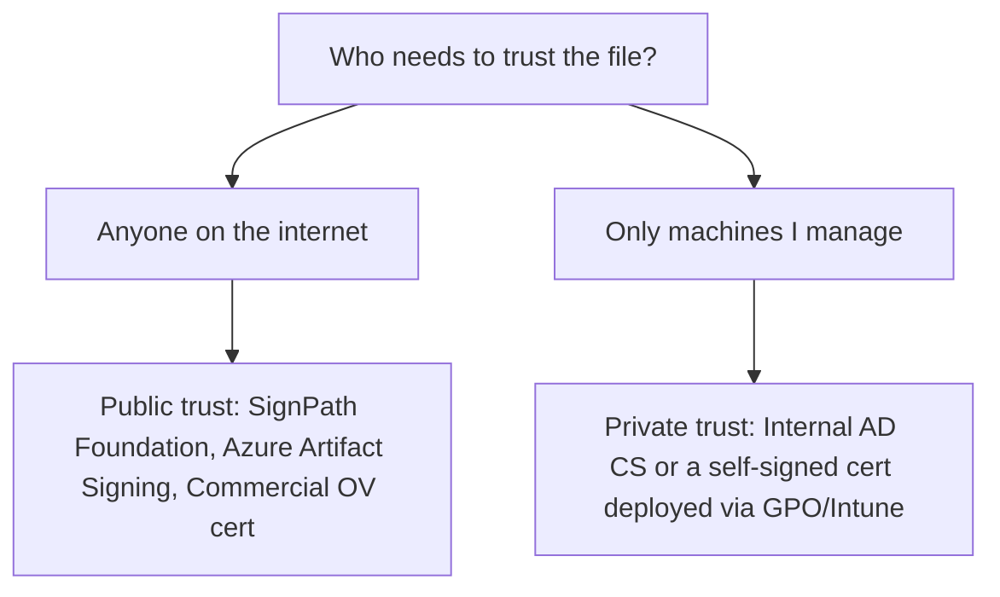
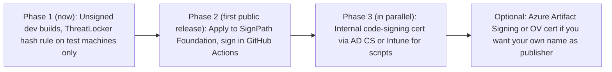

# Code Signing & PKI Plan (Side Quest)

> Applies to **Storage Visualiser** and is also useful for your wider IT estate (PowerShell scripts, internal tools, RMM payloads).
> Prices and eligibility were correct to the best of my knowledge in Oct 2026. **Check them before buying.**

---

## 1. Why sign at all?
| Benefit | Detail |
|---|---|
| **ThreatLocker** | Allow by **certificate/publisher** instead of file hash, so every new release is trusted automatically and no policy changes are needed per version. |
| **CrowdStrike** | Signed binaries from a consistent publisher get far fewer ML false positives and are easier to exclude cleanly. |
| **SmartScreen** | A publicly trusted signature builds reputation over time. Unsigned files get the scary "Unknown publisher" warning. |
| **Integrity** | Users and techs can confirm the file hasn't been tampered with (USB sticks get passed around). |
| **Cyber Essentials** | Not strictly required, but supports *malware protection* (application allowlisting is one of the accepted approaches) and *secure configuration*. |

## 2. What gets signed
- `StorageVisualiser.exe` plus any of our own DLLs, and the CLI exe if it's separate.
- Optional installer (later).
- Release PowerShell helper scripts (deployment scripts for NinjaOne/Action1).
- Always **timestamp** the signature (RFC 3161), so it stays valid after the certificate expires.

---

## 3. The two kinds of trust

You'll probably want **both**: public trust for the open-source releases, and private trust for internal scripts and tools.

---

## 4. Options in detail

### 4.1 SignPath Foundation (free for open source), ⭐ recommended for public releases
- Free code signing for qualifying OSS projects (OSI licence such as MIT, public repo, built by CI such as GitHub Actions).
- Keys live in SignPath's HSM, so you never handle a private key.
- **Catch:** the publisher shown is **"SignPath Foundation"**, not your name. You must apply and be accepted, and builds must come from CI, not your laptop.
- **ThreatLocker:** you can allow by that certificate. Narrow it with a path/product-name condition, because other OSS projects share the same publisher.

### 4.2 Azure Artifact Signing (formerly Trusted Signing)
- About **\$9.99/month** (Basic tier). Cloud HSM, short-lived certs managed by Microsoft, works well with GitHub Actions.
- **Public trust eligibility:** organisations, including UK businesses and sole traders, can be validated. **Individual** validation is currently limited to the **US/Canada**. As a UK individual you'd need to sign as a registered entity.
- **Private trust** mode has no geographic restriction and suits internal-only use.
- **Consideration:** signing as your **employer** puts the company's name on a personal open-source project. Agree that internally first, because it raises IP and ownership questions.

### 4.3 Commercial OV code-signing certificate (Sectigo, DigiCert, SSL.com, etc.)
- Around **£200–500/year**. Available to individuals worldwide.
- Since 2023 the private key **must** be on a hardware token or cloud HSM. USB tokens make CI signing awkward, so cloud HSM options (e.g. SSL.com eSigner) cost extra.
- Certificate lifetimes are shrinking under CA/B Forum rules, so expect more frequent renewals.
- Choose this if you want **your own name** as publisher and SignPath doesn't fit.

### 4.4 Internal PKI (AD CS), ⭐ recommended for internal scripts and tools
- Free if you already run, or are willing to run, **Active Directory Certificate Services**.
- Steps:
  1. Duplicate the **Code Signing** template and restrict enrolment to an "IT Code Signers" group.
  2. Enrol a cert for yourself, ideally with a non-exportable key or on a YubiKey/smartcard.
  3. Deploy the root CA to **Trusted Root** and the signing cert to **Trusted Publishers** via GPO/Intune.
  4. Optionally set PowerShell execution policy to **AllSigned** for managed scripts.
- **If you're Entra-only (no on-prem AD):** Intune Cloud PKI is aimed at device/user authentication certificates, not code signing. The pragmatic route is either a small offline root CA, or a **self-signed** code-signing cert whose public cert is deployed to Trusted Publishers via Intune.
- **Maintenance:** a CA is infrastructure in its own right. It needs patching, backup, CRL publishing and a documented runbook. That matters for Cyber Essentials scope.

### 4.5 Self-signed certificate
- Free and instant (`New-SelfSignedCertificate -Type CodeSigningCert`).
- Only trusted where you deploy it. Fine for a small estate managed via Intune/GPO.
- **Protect the private key carefully.** Anyone holding it can sign malware that your fleet will trust.

### 4.6 ThreatLocker hash/path rules (no signing)
- Works today with zero cost, but every new build needs a policy update. Use it **only as a stopgap** during early development.

---

## 5. Comparison
| | SignPath (OSS) | Azure Artifact Signing | Commercial OV | Internal AD CS | Self-signed |
|---|---|---|---|---|---|
| Cost | Free | ~\$10/mo | £200–500/yr | Free* | Free |
| Public trust | ✅ | ✅ (org-validated in UK) | ✅ | ❌ | ❌ |
| Publisher name | SignPath Foundation | Your org | You / your org | Your org | Anything |
| CI-friendly | ✅ | ✅ | ⚠️ token/HSM | ⚠️ | ⚠️ |
| Key handling | Managed HSM | Managed HSM | Token/HSM | Your CA | You |
| Effort | Apply once | Validate once | Buy/renew | Build/run CA | Minimal |

\* Free in licence cost, not in admin time.

---

## 6. Integrating with your stack

### ThreatLocker
- Create an application policy using the **certificate** (publisher) rule for Storage Visualiser.
- Add an **Elevation Control** policy for `StorageVisualiser.exe` so techs/users can elevate it for MFT fast scan without being local admins.
- Use the "Ringfencing" feature to stop the app reaching the network or launching other processes. This matches our "no network" design and makes a nice defence in depth.

### CrowdStrike
- Signed builds should rarely trigger. If they do, prefer a narrowly scoped **ML exclusion by certificate/path** over broad exclusions.
- MFT reading (raw volume access) can look suspicious to EDR. Test this early in the v1 work.

### NinjaOne / Action1
- Deploy the signed release folder plus checksum verification in the deployment script (compare against `SHA256SUMS.txt`).
- Sign the deployment PowerShell scripts with the internal cert.

---

## 7. Key-protection rules (non-negotiable)
1. Never commit a `.pfx`, private key or password to the repo. CI secret scanning must be enabled.
2. Prefer **HSM or managed signing** (SignPath / Azure) over key files.
3. If a key file exists, keep it non-exportable or on hardware (YubiKey), protected by MFA, with access limited to named people.
4. Always timestamp signatures.
5. Have a **revocation plan**: who revokes, how, and how ThreatLocker policies are updated if a key leaks.
6. CI signing runs only on protected branches/tags. Use GitHub OIDC rather than long-lived secrets where supported.

---

## 8. Recommended path

## 9. Checklist / decisions for you
- [ ] Is there an existing **AD CS** at work, or is it Entra/Intune-only?
- [ ] Are you happy with **"SignPath Foundation"** as the publisher name on public releases?
- [ ] Do you have, or want, a **sole-trader/business** registration? It unlocks Azure Artifact Signing in the UK.
- [ ] Would the company be comfortable with its name on the project? (Probably keep it personal.)
- [ ] Who are the named key holders and the revocation contact?
- [ ] Put a ThreatLocker certificate + elevation + ringfence policy on the to-do list for when v1 lands.
