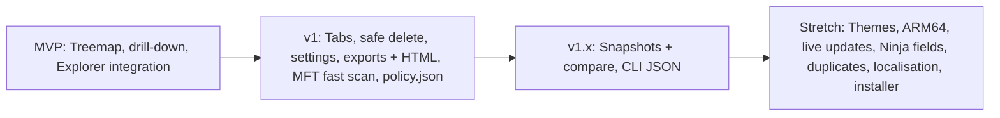

# Storage Visualiser — Scope & Requirements (v0.2)

| | |
|---|---|
| **Project name** | Storage Visualiser (exe: `StorageVisualiser.exe`) |
| **Licence** | MIT ("buy me a coffee" open source, commercial use OK) |
| **Platform** | Windows 10/11 x64 (ARM64 and other OSes are stretch goals) |
| **Status** | Scoping complete → next step: tech/language selection |
| **Related docs** | [code-signing.md](code-signing.md): code signing & PKI plan |

---

## 1. Vision
A modern, **portable**, **secure**, open-source disk-space visualiser for Windows. It's built around a **SpaceMonger 1.x-style nested treemap**: clean, calm and easy to read. It also has extra tabbed views (tree + % bars like RidNacs, plus lists) for IT techs. It should be safe to use commercially, deployable via NinjaOne/Action1 or a USB stick, and allowlistable in ThreatLocker.

## 2. Guiding principles
1. **The treemap comes first.** The SpaceMonger look (nested boxes, readable labels, a free-space block) is the hero view. It must not have WinDirStat's "pillow" clutter.
2. **Read-only by default.** Destructive actions are opt-in, confirmed and logged.
3. **Zero prerequisites.** One folder, copy and run. No installer, no runtime to install, no registry writes, no network calls.
4. **Works as a standard user.** Admin unlocks extras (fast MFT scan) but is never required.
5. **Privacy and security first.** When in doubt, pick the more secure option (Cyber Essentials context).
6. **Every dependency must be free for commercial use** (MIT/BSD/Apache/MS-PL style, no GPL/AGPL).
7. **Built for AI agents to maintain.** Clear modules, automated tests and a documented build.

## 3. Users
| Persona | Needs |
|---|---|
| **Normal user** | Pick a drive, see what's big, open it in Explorer. No jargon. |
| **IT tech** | Fast scans, admin-mode MFT, exports, snapshots/compare, safe delete. |
| **IT ops (RMM)** | Headless CLI via NinjaOne/Action1, machine-readable output, HTML report drop, org policy file. |

---

## 4. Decisions log
| # | Topic | Decision |
|---|---|---|
| D1 | OS / arch | Windows x64 first. ARM64 and other OSes are stretch goals. |
| D2 | Portability | One self-contained folder; no prerequisites; runs from USB/RMM drop. |
| D3 | Elevation | Standard user by default. "Restart as administrator" uses **normal UAC**. At work, ThreatLocker Elevation Control handles it via policy. The app needs no ThreatLocker-specific code. |
| D4 | Scan speed | 45–60 s for very large drives is acceptable. **MFT fast scan moved forward into v1** if feasible. |
| D5 | Network drives | Detect them and warn: "Network location, so scanning may be slow". No remote-machine scanning. |
| D6 | Cloud files | Never hydrate placeholders. Count **on-disk size only**. |
| D7 | Live updates | Manual rescan is fine. Live/incremental updates are a stretch goal, only if they can be done gracefully. |
| D8 | Views | Tabs: Map (SpaceMonger) · Tree (RidNacs-style %) · Top files · Types. |
| D9 | Colours | Switchable: depth / type / age. |
| D10 | Small items | Grouped into an "Other" block below a threshold. Free-space block only at drive root. |
| D11 | Animation | Short animated zoom (~150–250 ms), can be turned off. |
| D12 | Rescan | Split button: **Rescan folder** (default) ▾ Rescan drive. |
| D13 | Size units | Auto-scaling units with toggles (see §6.2). |
| D14 | Snapshots | Default filename `Storage Snapshot - <host> - <target> - <ISO 8601>` (see §6.5). |
| D15 | Snapshot privacy | **Privacy-first**: no automatic snapshots, explicit save only, restricted locations, optional encryption/redaction (see §7.3). |
| D16 | Policy file | Yes. IT can deploy a `policy.json` to lock settings. |
| D17 | Protected paths | A default blocklist, admin-editable via the policy file. |
| D18 | Updates | No in-app auto-updater. Updates come via RMM/redeploy. |
| D19 | Network access | None. No telemetry, no update checks. |
| D20 | Installer / context menu | Opt-in, later. Must be maintainable under Cyber Essentials. |
| D21 | CLI → NinjaOne custom fields | **Back burner** (stretch). A basic JSON CLI is still planned. |
| D22 | Language | English only for now. Localisation is a stretch goal, but strings are kept in resource files from day one. |
| D23 | Duplicate finder | Stretch goal / side quest. |
| D24 | Code signing | Separate plan in [code-signing.md](code-signing.md). |

---

## 5. Roadmap



### MVP: "Usable SpaceMonger replacement"
- Drive picker on launch (local / USB / network, labelled by type). Folder browser plus drag-and-drop.
- Multi-threaded directory-walk scanner (standard user). Cancellable, with progressive display if cheap.
- **Nested treemap**: folder title bars, labels, "Other" grouping, free-space block at drive root.
- Colour by depth (rainbow). Auto-scaled size labels.
- Navigation: double-click to zoom, Up/Back/Forward/Home, breadcrumb, Backspace, mouse back/forward buttons, animated zoom.
- Info bar/tooltip: name, size, % of parent, file/folder count, modified date.
- Right-click: **Open in Explorer (item selected)**, Open, Copy path, Properties.
- Rescan split button. Network-drive warning. Access-denied folders shown as "inaccessible" blocks.

### v1: "IT-tech ready"
- Tabs: **Map · Tree · Top files · Types**.
- Colour modes: depth / type / age. Colour-blind-safe palette.
- **Delete → Recycle Bin**: confirmation, protected-path blocklist, action log. Permanent delete off by default. "Disable delete" setting. Optional auto-rescan after delete.
- Settings dialog (SpaceMonger-inspired): density, H/V bias, tooltip fields and delay, animation, colours, size metric, units.
- **`policy.json`** org policy support (see §7.2).
- Exports: **self-contained interactive HTML report**, CSV and JSON.
- Allocated vs logical size toggle.
- **NTFS MFT fast scan** when elevated, with automatic fallback to the walker.
- High-DPI, multi-monitor, keyboard navigation.

### v1.x: "Power features"
- **Snapshots**: explicit save/open, read-only for file actions.
- **Compare two snapshots**: grew / shrank / new / removed, as a diff list and treemap.
- **CLI**: `StorageVisualiser.exe scan C:\ --top 20 --json` / `--html <file>` / threshold exit codes. Runs as SYSTEM under RMM.

### Stretch goals
- Themes (dark/light/custom).
- ARM64 build.
- Live/incremental updates (USN journal / watcher).
- NinjaOne custom-field output and agreed metrics.
- Duplicate finder.
- Localisation.
- Opt-in installer + "Scan with Storage Visualiser" context menu.
- macOS/Linux, if the stack allows.

---

## 6. Functional requirements

### 6.1 Scanning
| ID | Requirement | Phase |
|---|---|---|
| S1 | Scan drive, folder or UNC path as a standard user | MVP |
| S2 | Detect volume type and file system; warn on network | MVP |
| S3 | Never hydrate cloud placeholders; on-disk size only; flag "online-only" | MVP |
| S4 | Don't follow junctions/symlinks; count hardlinks once | MVP |
| S5 | Access-denied folders shown as an "inaccessible" block with a count | MVP |
| S6 | Cancellable; progressive display if cheap | MVP |
| S7 | Allocated vs logical size toggle | v1 |
| S8 | MFT direct read when elevated (NTFS), with automatic fallback | v1 |
| S9 | Target: 5M files on local SSD in under 60 s (walker); MFT much faster | MVP / v1 |

### 6.2 Size display (D13)
- **Auto mode (default):** picks the most readable unit per item, e.g. `1.28 GB`, `512 KB`, `14 bytes`.
- **Exact mode:** full byte count with thousands separators, e.g. `1,374,830,776 bytes`, as SpaceMonger does.
- **Unit system** setting:
  | Option | Base | Labels | Notes |
  |---|---|---|---|
  | Windows-style (default) | 1024 | KB, MB, GB, TB | Matches Explorer, so it's least confusing for normal users |
  | IEC binary | 1024 | KiB, MiB, GiB, TiB | Technically precise |
  | SI decimal | 1000 | kB, MB, GB, TB | Matches drive manufacturers' labels |
- Labels **fall back gracefully** as boxes shrink: name + size + date → name + size → name → nothing (tooltip only).
- Tooltips can show both forms, e.g. `1.28 GB (1,374,830,776 bytes)`.
- The same unit setting applies to exports. CSV/JSON always include raw bytes as well, for parsing.

### 6.3 Treemap (Map tab)
- Nested layout: each folder has a title bar, with children inside it.
- Squarified layout with H/V **bias** and **density** settings.
- "Other (n items)" block below a threshold (e.g. under 0.5% of parent or under N px).
- Free-space block only when the view root is a drive root.
- Flat colours with thin borders. No gradients or cushions.

### 6.4 File actions
| Action | Phase | Notes |
|---|---|---|
| Open in Explorer (selected) | MVP | |
| Open / Copy path / Properties | MVP | |
| Delete → Recycle Bin | v1 | Confirmation, blocklist, log |
| Permanent delete | v1 | Off by default; can be forbidden by policy |
| Auto-rescan after delete | v1 | Setting |
| Rename / Move | Later | Explorer covers this |

### 6.5 Snapshots, reports & CLI
- **Default snapshot filename (D14):**
  `Storage Snapshot - <HOSTNAME> - <Target> - <ISO 8601>.svsnap`
  e.g. `Storage Snapshot - LAPTOP42 - C - 2026-10-03T224824+0100.svsnap`
  - Uses ISO 8601 **basic time format** (`HHMMSS`), because `:` isn't allowed in Windows filenames. The date keeps its dashes so it stays readable, and the name sorts chronologically.
  - Host and target segments are optional (setting). The user can edit the name before saving.
  - The same pattern is used for exports: `Storage Report - … .html` / `.csv` / `.json`.
- HTML report: one file, no external resources, opens offline.
- CSV: formula-injection neutralisation (`=`, `+`, `-`, `@`).
- Snapshots opened from file are **read-only for file actions**. Paths from snapshots prompt before opening anything remote.
- CLI: same engine; JSON to stdout; exit codes; no UI dependency.

---

## 7. Non-functional requirements

### 7.1 Portability & deployment
- Self-contained x64 folder, no prerequisites.
- Settings: `settings.json` next to the exe. If that folder is read-only, fall back to `%LOCALAPPDATA%\StorageVisualiser`.
- No registry writes, no auto-updater, no network.

### 7.2 Org policy file (D16, D17)
- `policy.json` next to the exe, or in `%ProgramData%\StorageVisualiser\policy.json` (an admin-writable location takes priority).
- Policy **overrides and locks** user settings. Locked options are greyed out with "Managed by your organisation".
- Example controls:
  ```json
  {
    "deleteMode": "disabled | recycleBinOnly | allowPermanent",
    "protectedPaths": ["C:\\Windows", "C:\\Program Files", "C:\\Program Files (x86)", "C:\\ProgramData", "%USERPROFILE%"],
    "protectedPathsMode": "append | replace",
    "allowSnapshots": true,
    "snapshotEncryption": "required | optional | off",
    "allowExports": true,
    "redactPathsInExports": false,
    "allowElevation": true,
    "allowNetworkPaths": true
  }
  ```
- If the policy file is malformed, the app **fails safe**: the most restrictive settings apply and a warning is shown.
- The protected-path blocklist has sensible built-in defaults. Policy can append to or replace it. Protected paths stay browsable, but delete is blocked.

### 7.3 Snapshot & report privacy (D15)
File paths can reveal names, client projects and personal data, so the defaults are cautious:
1. **No automatic snapshots.** Snapshots are written only on explicit Save (GUI) or an explicit CLI flag.
2. **GUI default location:** the user's own Documents folder (user-chosen). Nothing is written silently next to the exe on shared USB sticks.
3. **CLI/RMM location:** `%ProgramData%\StorageVisualiser\Snapshots`, created with ACLs limited to **SYSTEM + Administrators**.
4. **Optional encryption:** DPAPI (user or machine scope) for snapshot files. It can be set to "required" by policy.
5. **Optional redaction** for exports/reports: hide paths below depth N, or anonymise user-profile names (e.g. `C:\Users\<user>\…`).
6. **Retention:** an optional max-age/count for CLI snapshots, so they don't build up.
7. Exports show a one-line reminder: "This report contains file and folder names."
8. Snapshot files are treated as **untrusted input**: versioned format, size limits, strict parsing.

### 7.4 Security (Cyber Essentials–friendly)
- No network access. Standard user by default. Elevation via UAC (ThreatLocker Elevation Control at work).
- Code-signed releases. See [code-signing.md](code-signing.md).
- Releases ship with SHA-256 checksums and an SPDX SBOM. Dependencies are licence-checked and CVE-scanned in CI.
- A versioned changelog and release process, so the software counts as "supported and patched".
- Action log for deletes (local, next to settings).

### 7.5 Performance & UX
- About 5M files in ≤1–1.5 GB RAM. UI stays responsive during scans. Zoom animation at 60 fps.
- Clean, calm and uncluttered: plain English for normal users, detail on demand for techs.
- High-DPI, keyboard accessible, colour-blind palette option.

---

## 8. Lessons from Custodian (MIT, ideas and code reusable with attribution)
[C-Tech-Solutions/custodian](https://github.com/C-Tech-Solutions/custodian) is a .NET 10 WPF analyser with a CLI, TUI, MFT scan and portable build. Worth adopting:
- Auto scanner mode (MFT → walker fallback).
- Cloud-provider-aware scanning without hydration.
- Imported scans are review-only.
- Remote-path confirmation.
- CSV formula neutralisation.
- Release hygiene (SBOM, checksums, attestations).

Where we differ: SpaceMonger-style treemap as the hero, no auto-updater, a simpler UI for normal users, and a policy file plus privacy controls.

> [!TIP]
> At tech-selection time we'll review Custodian's MFT reader and placeholder handling for reuse. Reuse is easiest if we choose .NET.

## 9. Out of scope
- Remote scanning of other machines (the CLI via RMM covers this).
- Cloud APIs of any kind.
- Any SpaceMonger code, assets or branding. We use the layout concept only.

## 10. Next steps
1. ✅ Scope agreed (this doc).
2. ⏭️ **Tech/language selection:** compare candidate stacks against these requirements (portability, performance, treemap rendering, MFT access, licences, AI-maintainability).
3. Code signing route chosen (see [code-signing.md](code-signing.md)).
4. Repo setup: structure, CI, licence, README, contribution notes for AI agents.
5. Build the MVP.
