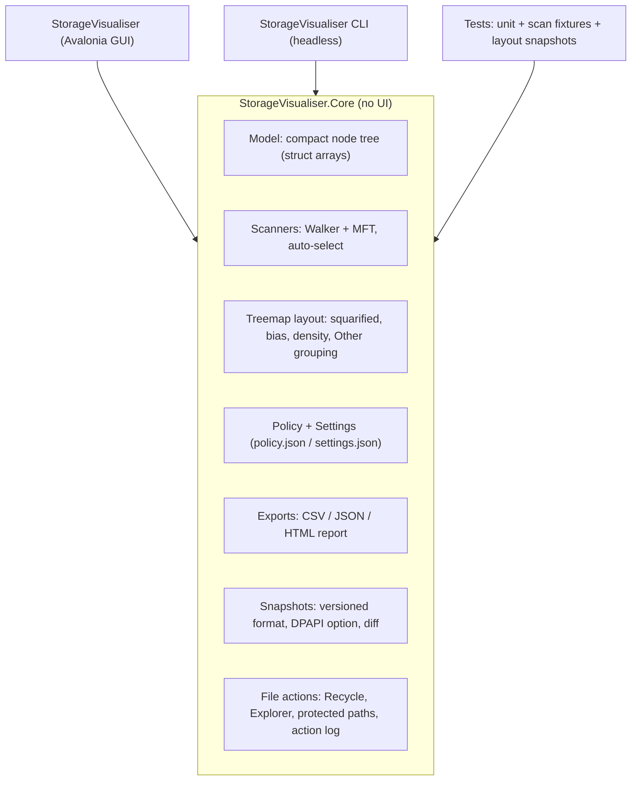

# Storage Visualiser — Tech / Language Selection (v0.1)

> Input: [scope.md](scope.md) v0.2. Output: a recommended stack plus a short **spike** (proof-of-concept) to prove the risky parts before building the MVP.

---

## 1. What the stack must handle (from scope)
| # | Requirement | Why it matters for the choice |
|---|---|---|
| R1 | **Portable folder, zero prerequisites** | No runtime installs; nothing like "please install .NET / WebView2 / VC++ redist" |
| R2 | **Fast custom treemap rendering** | Thousands of nested boxes, labels, 60 fps zoom animation. Needs GPU or fast 2D drawing, not standard UI controls |
| R3 | **Deep Windows integration** | Raw NTFS MFT, cloud placeholder attributes, Recycle Bin, Explorer "select item", Properties dialog, UAC relaunch, DPAPI, ACLs |
| R4 | **Large data** | ~5M nodes in ≤1–1.5 GB RAM; multi-threaded scanning |
| R5 | **Headless CLI** from the same engine | Runs as SYSTEM under NinjaOne with no UI |
| R6 | **Licences** free for commercial use | MIT/BSD/Apache only |
| R7 | **AI-maintainable** | Popular, well-documented language; strong compiler and tests to catch AI mistakes |
| R8 | **Security** | Small attack surface, no network, signable, low EDR false-positive risk |
| R9 | Stretch: ARM64, macOS/Linux, themes | Nice if the stack makes it cheap |
| R10 | Accessibility, high-DPI, keyboard | Comes almost for free with a proper UI framework |

---

## 2. Candidates

### A. C# / .NET 10 + **Avalonia UI** + SkiaSharp ⭐
- Modern XAML UI framework (MIT), rendered with Skia (the engine behind Chrome), so it's very fast for custom drawing like a treemap.
- Supports **Native AOT** (compiled to a real native exe, no runtime needed, fast start-up), and ARM64/macOS/Linux at no extra cost.
- Full .NET for Windows interop: P/Invoke, `ProtectedData` (DPAPI), ACLs, `System.Text.Json`, `System.CommandLine`.
- Can **reuse Custodian's MIT code** (MFT reader, cloud placeholder detection) with only light porting, since it's also .NET.

### B. C# / .NET 10 + **WPF**
- Very mature, Windows-only. Same .NET benefits as A.
- ❌ **No trimming or Native AOT**, so the self-contained folder is ~150 MB and start-up is slower. Its standard rendering is slower for huge custom drawings. No path to other platforms.

### C. C# / .NET + **WinUI 3**
- Microsoft's newest Windows UI. ❌ Unpackaged/portable deployment is awkward (Windows App SDK runtime bootstrapping), the tooling is heavier and the framework is less stable. Poor fit for "copy a folder and run".

### D. **Rust** + egui (or Iced)
- ✅ Tiny single native exe (~5–10 MB), memory-safe, very fast, no runtime.
- ⚠️ Immediate-mode UI looks less "native"; accessibility is improving but behind the others. Windows shell interop via `windows-rs` is verbose. No Custodian reuse. Slower iteration for agents (stricter compiler, which is safer but takes longer).

### E. **Tauri** (Rust backend + HTML/JS UI)
- ✅ Small exe; the **same JS treemap could power both the app and the HTML report**, which is an attractive synergy.
- ❌ Depends on **WebView2**. It's present on most Win10/11 machines but **not guaranteed** (LTSC, Server, locked-down images). Bundling the fixed runtime adds ~180 MB. Pushing 5M-node data across the JS bridge is a performance risk. Two languages to maintain.

### F. C++ + Win32/Direct2D
- ✅ Fastest and smallest, the SpaceMonger way. ❌ Memory-safety risk (a security concern), slow to build UI, and the worst fit for AI-driven maintenance.

*(Electron, Python and Java were dismissed: too large, need runtimes, or are too slow for 5M nodes.)*

---

## 3. Scoring
Weights reflect the scope priorities (1–5 score × weight).

| Criterion | Weight | A .NET+Avalonia | B WPF | C WinUI 3 | D Rust+egui | E Tauri | F C++ |
|---|---|---|---|---|---|---|---|
| R1 Portable, no prereqs | 5 | 5 | 3 | 2 | 5 | 3 | 5 |
| R2 Treemap performance | 5 | 5 | 3 | 4 | 5 | 3 | 5 |
| R3 Windows integration | 4 | 5 | 5 | 5 | 3 | 3 | 5 |
| R4 Large data / memory | 4 | 4 | 4 | 4 | 5 | 3 | 5 |
| R5 Shared CLI engine | 3 | 5 | 5 | 5 | 5 | 4 | 4 |
| R7 AI maintainability | 5 | 5 | 5 | 3 | 4 | 3 | 2 |
| R8 Security / attack surface | 4 | 4 | 4 | 4 | 5 | 3 | 2 |
| Reuse (Custodian code) | 2 | 5 | 5 | 4 | 1 | 1 | 1 |
| R9 Stretch platforms | 1 | 5 | 1 | 1 | 4 | 5 | 2 |
| R10 Accessibility / DPI | 3 | 4 | 5 | 5 | 3 | 4 | 3 |
| **Total (max 180)** | | **168** | 147 | 136 | 152 | 116 | 135 |

---

## 4. Recommendation: **C# / .NET 10 (LTS) + Avalonia UI + SkiaSharp, Native AOT**

**Why:**
1. **Portable and quick to start:** AOT publishes a self-contained native folder (expect roughly 30–60 MB) with no runtime to install, which meets R1.
2. **The treemap runs on Skia:** we draw it ourselves on a GPU-accelerated canvas, so animation is smooth and there's no control overhead per box.
3. **Easiest stack for Windows-specific work:** MFT, Recycle Bin, DPAPI and ACLs are all straightforward in .NET, and Custodian (MIT) shows they work.
4. **AI agents are fluent in C#,** and its strong typing, analysers and test tooling catch mistakes early.
5. **Leaves the door open** for ARM64 and macOS/Linux later with the same code.

**Runner-up: Rust + egui.** Choose it only if the smallest possible single exe matters more than development speed and Windows-integration convenience.

**The HTML report** is generated by the .NET engine. It embeds a small, dependency-free **vanilla JS + Canvas** treemap, with the data inlined as JSON, so the report is one self-contained file that works offline.

---

## 5. Proposed architecture



**Repo layout:**
```
/src
  StorageVisualiser.Core/       # engine – no UI references
  StorageVisualiser.Windows/    # Win32 interop: MFT, shell, recycle bin, DPAPI, ACLs
  StorageVisualiser.App/        # Avalonia GUI (Map, Tree, Top files, Types tabs)
  StorageVisualiser.Cli/        # headless CLI
  StorageVisualiser.Report/     # HTML report template (vanilla JS, embedded resource)
/tests
  StorageVisualiser.Core.Tests/
/docs                           # scope.md, code-signing.md, tech-selection.md, decisions
/build                          # publish scripts, SBOM, checksums
.github/workflows/              # CI: build, test, licence + CVE scan, SignPath signing
AGENTS.md                       # rules for AI agents working in this repo
```

**Key libraries (all commercial-friendly):**
| Purpose | Library | Licence |
|---|---|---|
| Runtime | .NET 10 | MIT |
| UI | Avalonia 11.x | MIT |
| 2D rendering | SkiaSharp | MIT |
| MVVM helpers | CommunityToolkit.Mvvm | MIT |
| CLI parsing | System.CommandLine | MIT |
| JSON | System.Text.Json (built-in) | MIT |
| Tests | xUnit + FluentAssertions *(v7 only, since v8 changed licence)* or Shouldly | Apache-2.0 / BSD |
| Snapshot storage | Custom compressed binary (preferred), or Microsoft.Data.Sqlite | — / MIT |
| Ideas/code reuse | Custodian | MIT (attribution in `THIRD-PARTY-NOTICES.md`) |

> [!WARNING]
> Avalonia's **core is MIT**, but some optional add-ons ("Avalonia Accelerate", certain premium controls) are paid. We'll use only the MIT core packages, and CI will run a licence check to enforce that.

---

## 6. Dev machine prerequisites
Checked on your machine:
| Tool | Status | Needed for |
|---|---|---|
| Git | ✅ 2.56 | Source control |
| Node.js | ✅ v24 | Optional (testing the HTML report JS) |
| .NET 10 SDK | ❌ **Not installed** (`dotnet` exists but no SDKs) | Building everything |
| Visual Studio Build Tools (C++ workload) | ❓ To check | Required by **Native AOT** publishing |
| GitHub repo | ❓ | CI and SignPath (needs a public repo plus GitHub Actions) |

I can install these with `winget` once you approve the stack:
```powershell
winget install Microsoft.DotNet.SDK.10
winget install Microsoft.VisualStudio.2022.BuildTools --override "--add Microsoft.VisualStudio.Workload.VCTools --includeRecommended --passive"
```

---

## 7. Risks and the spike (proof-of-concept before MVP)
A spike of about one session to prove the risky parts:

| # | Risk | Spike test | Pass criteria |
|---|---|---|---|
| K1 | Treemap rendering speed in Avalonia/Skia | Render a nested treemap of a synthetic 1M-node tree, with zoom animation | 60 fps zoom, re-layout < 100 ms |
| K2 | Walker scan speed | Multi-threaded scan of `C:\` as a standard user | Comparable to WinDirStat or faster; memory in budget |
| K3 | Native AOT + Avalonia publish | Publish a portable x64 folder, run from USB on a clean VM | Runs with no prerequisites; record the size |
| K4 | EDR reaction | Run the AOT build on a CrowdStrike/ThreatLocker machine (later: the MFT build) | No detections, or know what to exclude |
| K5 | Cloud placeholders | Scan a OneDrive folder with online-only files | Zero downloads triggered |

If K1 or K3 fail badly, we fall back to the runner-up (Rust + egui) before investing in the MVP.

---

## 8. Decisions needed
1. ✅/❌ Approve **.NET 10 + Avalonia + SkiaSharp (Native AOT)**.
2. OK for me to install the **.NET 10 SDK** and **VS Build Tools (C++)** via winget?
3. **GitHub:** create the repo now (public, MIT) so CI and SignPath can be set up early? Which account or org name?
